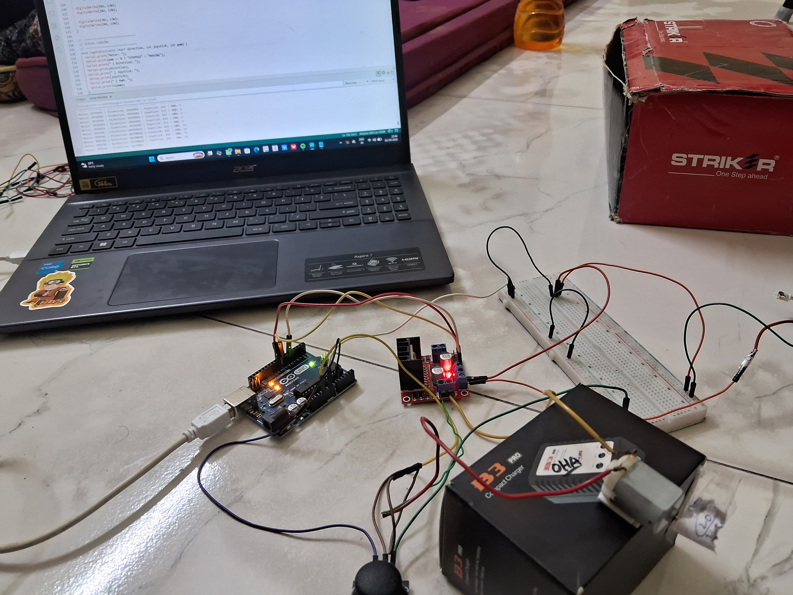
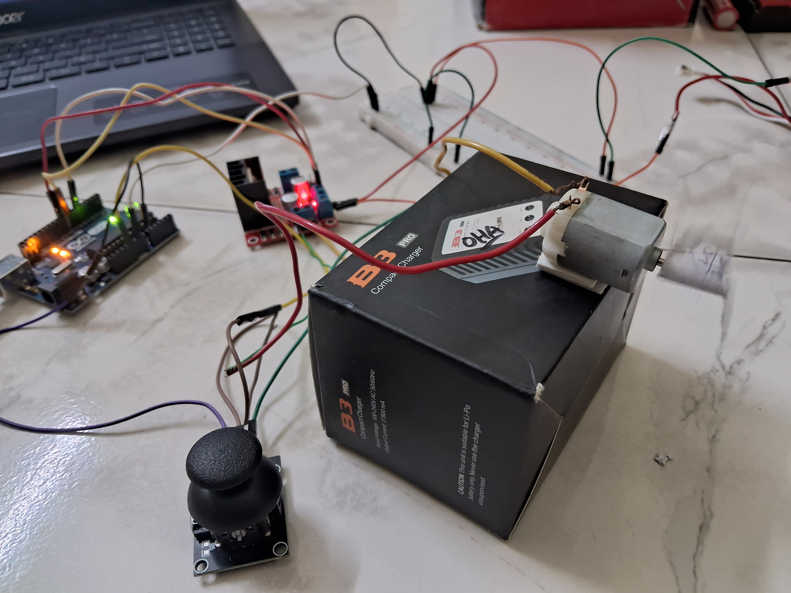
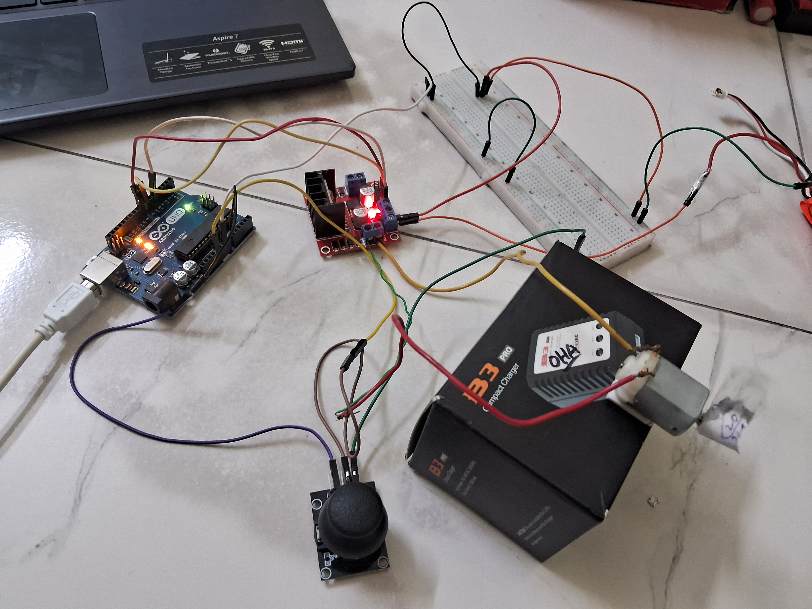

# Joystick-Controlled EV Motor Controller Prototype

> A hands-on embedded systems prototype simulating proportional throttle and direction control — the foundational control loop in EV drivetrains.

---

## Overview

This project implements a **single-channel joystick-to-motor control system** using an Arduino Uno and L298N H-bridge driver. The joystick's Y-axis is read as an analog signal, mapped to a PWM duty cycle, and used to control a TT gear motor's speed and direction in real time.

The focus was on understanding H-bridge motor drive fundamentals, PWM control via a microcontroller, dead zone filtering, and power stage grounding — concepts directly applicable to embedded motor control in EV and robotics systems.



---

## Hardware Stack

| Component | Details |
|---|---|
| Microcontroller | Arduino Uno |
| Motor Driver | L298N Dual H-Bridge module |
| Motor | TT Gear Motor (3–6V DC) |
| Power Source | 2S Li-ion battery (~7.4V nominal) |
| Input | Analog joystick module (Y-axis used) |
| Control Interface | Arduino Serial Monitor (debug / demo) |

> **Note:** This prototype uses **one motor channel** (Motor A / ENA, IN1, IN2). The L298N's second channel is wired but not driven independently — the architecture supports dual-channel extension.

---

## System Architecture

```
Joystick (VRy)
     |
     v
Arduino ADC (A0) — 10-bit resolution → 0 to 1023
     |
     v
Dead Zone Filter
  ┌─────────────────────────────────────┐
  │  < 462 → BACKWARD                  │
  │  462–562 → STOP (dead zone)        │
  │  > 562 → FORWARD                   │
  └─────────────────────────────────────┘
     |
     v
PWM Mapping (MIN_PWM=70 to 255)
  — floor prevents stall at low joystick displacement
     |
     v
Direction Logic → IN1 / IN2 pin states
Speed Logic    → ENA PWM duty cycle
     |
     v
L298N H-Bridge
     |
     v
TT Gear Motor (forward / stop / backward)
```

---

## Key Implementation Details

**Dead Zone Filtering**
Center resting position of a joystick rarely reads exactly 512. A ±50 ADC count dead zone prevents motor jitter when the joystick is untouched.

**MIN_PWM Floor**
TT gear motors have a static friction threshold — below ~70/255 PWM, the motor does not rotate regardless of the command. Mapping from `MIN_PWM` to 255 (instead of 0 to 255) eliminates this false-stop region.

**Shared Ground Architecture**
Battery(–), Arduino GND, and L298N GND are tied to a common reference. This is required for PWM logic signals from the Arduino (referenced to its own GND) to be correctly interpreted by the L298N power stage. Missing this causes erratic or no motor response — a common beginner fault this build deliberately addressed.

**L298N ENA Jumper Removal**
The L298N breakout board ships with a physical jumper that bypasses ENA, locking motors at full speed. Removing it hands PWM control back to the microcontroller.



---

## Pin Mapping

| Arduino Pin | L298N Pin | Function |
|---|---|---|
| D5 | ENA | Motor A speed (PWM) |
| D7 | IN1 | Motor A direction bit 1 |
| D8 | IN2 | Motor A direction bit 2 |
| A0 | — | Joystick Y-axis input |

---

## Serial Monitor Output (Live Debug)

```
EV MOTOR CONTROLLER STARTED
Motor: MOVING | Direction: FORWARD | Joystick: 720 | PWM: 143
Motor: MOVING | Direction: FORWARD | Joystick: 900 | PWM: 212
Motor: STOPPED | Direction: STOPPED | Joystick: 510 | PWM: 0
Motor: MOVING | Direction: BACKWARD | Joystick: 200 | PWM: 175
```

---

## Wiring Notes

- Battery(+) → L298N VCC (12V input)
- Battery(–) → L298N GND ↔ Arduino GND (common ground — mandatory)
- L298N 5V output → Arduino 5V (onboard regulator powers logic layer)
  - Do **not** simultaneously power Arduino from USB when doing this
- Remove ENA jumper cap from L298N board before use



---

## Known Limitations & Planned Extensions

| Limitation | Planned Fix |
|---|---|
| Single motor channel only | Add Motor B for differential drive (turning control via X-axis) |
| No stall/overcurrent protection | Add current sensing resistor + threshold interrupt |
| MIN_PWM is hardcoded | Calibrate per motor batch; store in EEPROM |
| No physical enclosure | Chassis integration TBD |

---

## Skills Demonstrated

`Embedded C/C++` · `PWM Motor Control` · `H-Bridge Drive Logic` · `Analog Signal Conditioning` · `Power Stage Grounding` · `Arduino IDE` · `Serial Debug Interface`

---

